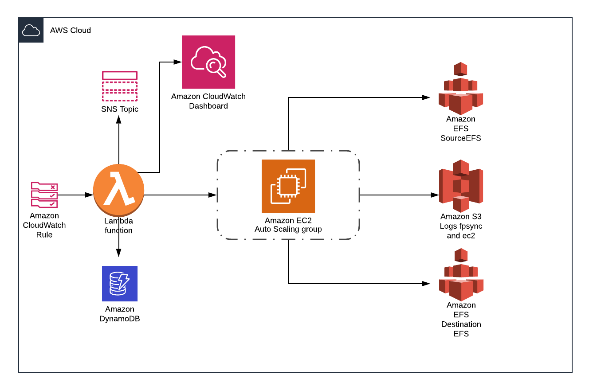

# EFS Backup Solution
EFS backup solution performs backup from source EFS to destination EFS. It utilizes fpsync utils (fpart + rysnc) for efficient incremental backups on the file system.

# Description
The EFS-to-EFS backup solution leverages Amazon CloudWatch and AWS Lambda to automatically create incremental backups of an Amazon Elastic File System (EFS) file system on a customer- defined schedule. The solution is easy to deploy and provides automated backups for data recovery and protection. For example, an organization can use this backup solution in a production environment to automatically create backups of their file system(s) on daily basis, and keep only a specified number of backups. For customers who do not have a mechanism for backing up their Amazon EFS file systems, this solution provides an easy way to improve data protection and recoverability.

# Architectural Workflow
•	The orchestrator lambda function is first invoked by CW event (start backup) schedule defined by the customer. The lambda function creates a 'Stop Backup' CWE event and add the orchestrator (itself) lambda function as the target. It also updates desired capacity of the autoscaling group (ASG) to 1 (one). Auto Scaling Group (ASG) launches an EC2 instance that mounts the source and target EFS and backup the primary EFS.

•	The orchestrator lambda function writes backup metadata to the DDB table with backup id as the primary key.

•	Fifteen minutes before the backup window defined by the customer, the 'Stop' CWE invokes orchestrator lambda to change the desired capacity of ASG to 0 (zero).

•	The lifecycle hook CWE is triggered by ASG event (EC2_Instance_Terminating). This CWE invokes the orchestrator lambda function that use ‘AWS-RunShellScript’ document name to make send_command api call to the SSM service.

•	During the lifecycle hook event, the EC2 instance will stop/cleanup rsync process gracefully and update the DDB table with the KPIs, upload logs to the S3 bucket.

•	The EC2 successful termination trigger another lifecycle hook event. This event triggers the orchestrator lambda function to send the anonymous metrics, notify customer if complete backup was not done.

# Launch Solution Stack

# Original Concept
The solution is a modification of a AWS Quickstart which solves the problem of EFS to EFS backup. However this solution adds the cross region capability to the solution.